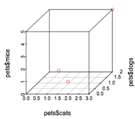
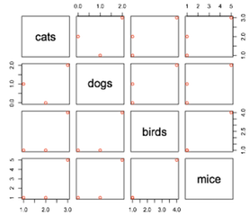
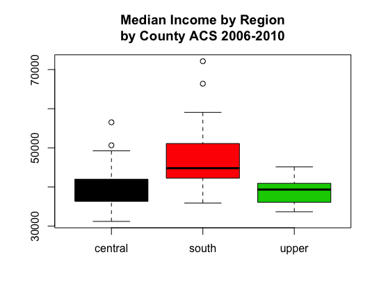
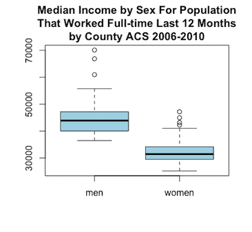
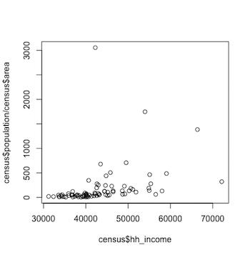

```{r global_options_&_setup, include=FALSE}
knitr::opts_chunk$set(eval=FALSE, tidy = TRUE, fig.align='center', out.width = '70%', out.height = '70%')
```

# Tutorial Outline

This tutorial is the first of a two-part series providing some basic instruction on how to (a) visualize data, and (b) use R for visualizations.

**Part 1** Includes:

1. **Installing R and Quick Tips**
      - Install R
      - Quick Tips
2. **Upload Data**
3. **Understanding your Data Before Visualization**
      i. *Choosing Appropriate Visualization(s)*  
            - Dimensionality  
            - Defining Data Types  
            - Putting it Together  
      ii. *Organizing and Re-Structuring Data in R*  
            - Mapping to a Different Scale  
            - Selecting Subsets  
            - Scaling and Normalizing  
            - Aggregating  
4. **Visualizing 'Simple' Data (1-3 variables)**
      i. *Visualizing 1 Variable*  
            - Histograms  
            - Boxplots  
      ii. *Visualizing 2-3 Variable*

*To see* **Part 2**, *visit: INSERT LINK HERE*

# 1. Installing R and Quick Tips

#### Install R
[R](https://www.r-project.org) is an open source language for graphics and statistical computing, and **must be downloaded** [here](https://cran.r-project.org/mirrors.html) **for this tutorial** by selecting your preferred CRAN mirror. ([RStudio](https://www.rstudio.com/) is a helpful and commonly used graphical user interface for R, which can be downloaded [here](https://www.rstudio.com/products/rstudio/download3/) if desired.)

#### Quick Tips
To operate in R, you can run single commands or scripts (essentially text files with lists of commands). Each command or function can have parameters defined by the user. 

Any text preceeded by a `#` is a comment to explain the code, and is not run by R.

Both `<-` or `=` are used to assign data to a variable (e.g. x) or data frame (essentially a data set containing data from multiple variables x, y, z, etc.). For example, running the following R code produces the answer seen in the second box:
```{r eval=TRUE}
x <- 2 #assigns the value '2' to the variable x
y = 3 #assigns the value '3' to the variable y
sumofxy <- sum(x,y) #uses the sum() function to add variables x and y, saving the results into variably sumofxy
sumofxy #displays value of sumofxy
```

To find information about a function or parameter in R, precede the function or parameter with `?` in the console:
```{r tidy=FALSE}
?sum
```

To begin getting a feel for R, run the following lines of helpful tricks in your R environment:
```{r}
#a few helpful tricks
########
c(1,2,3) #concatenate a set of elements
1:20 #list numbers between two numbers
colors() #list all of R's colors
palette() #show the current order of colors

palette(rainbow(6)) #set colors
palette() #shows how current order of colors has been re-defined 

palette(c("green","brown","red")) #set user defined colors
palette() #shows how current order of colors has been re-defined 
```

One advantage of R being free and open source is a large base of users have created a wide diversity of 'plug-ins' available to users in the form of *packages*.

For further exploration of R, below are a few introductory resources: 

- [*Tutorials for Learning R*](https://www.r-bloggers.com/how-to-learn-r-2/) on r-bloggers.com
- [*Quick R*](http://www.statmethods.net/) by Robert I. Kabacoff, Ph.D.
- [*R for Data Science*](http://r4ds.had.co.nz/) by Garrett Grolemund and Hadly Wickham

# 2. Upload data to R

To complete this tutorial, first **download and unzip the folder provided at the top of this tutorial**. Next, run the following line of code in the R console, which prompts you to select the provided `data.csv` file within the downloaded folder. 
```{r}
census <- read.csv(file.choose()) #read in the csv file
```
This code loads the data into our R environment. We can call the data frame anything we want, but in this example we've used the name `census`, as it is census data downloaded from the [American Community Survey](https://www.census.gov/programs-surveys/acs/) for the state of Michigan from 2006-2010.

After uploading your `census` data into the R environment, run the following lines of code to explore your dataset.
```{r}
View(census) #view the data table in its entirety
names(census) #see all header (column) names
head(census) #see the headers plus the first six rows of data within each header
summary(census) #see some summary statistics of each column
fix(census) #open an excel-esque data editor (CAREFUL: there is no record of this change, nor does it change the data in the csv file)
```

To select a column of data, preface the name of the columns with the name of the data from (in this case, `census`) and a `$`.
```{r}
census$rent
census$region
```


# 3. Understanding your Data {.tabset}

Before visualizing data, it's important to define your research question, understand the underlying data you're working with, and prepare the appropriate data as needed for visualization. 

The first step is using your research question to identify the number of variables you're interested in comparing---i.e. the dimensionality of your analysis---and the type of data contained in each variable of interest---e.g. is it continuous or discrete? 

Sometimes a second step is required, where the data needs to be organized or re-structured before the final step of visualization.

### 3.i. Choosing Appropriate Visualization(s)

#### Dimensionality

The dimensionality, or number of variables you're interested in comparing, determines the type(s) of visualizations available to you.  

To illustrate what different dimension may look like, let's take data on your friends Jane, John, and Moe and document how many cats and dogs they have. You're interested in  seeing the relationship between having a cat (one variable) and having a dog (another variable). Since you're interested in two variables, this analysis is **2-dimensional**:  

  

If you also ask your friends about their pet mice, you'd now be interested in three variables (number of cats, dogs, mice), or a **3-dimensional** analysis:  

  

The dimensionality of an analysis is theoretically limitless, but becomes increasingly complicated and harder (although often more interesting) to visualize the more variables that are included. How would you graph your friends' pet preferences once you added the fourth dimension of bird data?


There are many interesting ways to visualize multiple dimensions, but a good place to start is often in 2-dimensions, as matching each variable to every other variable in a pair-wise fashion begins to reveal relationships in the dataset.



Each visualization requires careful consideration of which relationships are important to show.  

The following visualization of the 4 pet types, for example, is effective in showing how pets are distributed among your friends, but makes the relationship between owning one type of pet and owning another type of pet less clear than the previous visualization. 


#### Defining Data Types

Knowing what kind of data you're visualizing is also important, because it determines a great deal of your visualization (and statistical) possiblities. Each one of your variables should be classified as one of the following:

|DATA TYPE   |Defined As...                  | Example                       |
|:-----------|:-----------------------------:|:-----------------------------:|
|**Continuous** |can take any value over a continuous range of numbers|A dog's weight: could be measured to any fraction of a pound|
|**Discrete  (ordered)**|can only take on particular set of values that have an order in relation to each other| Number of dogs your friends own. (They can't own half a dog.) |
|**Discrete  (unordered)**|can only take on particular set of values that have no order associated with them; can think of as bins, no in-between values and no inherent order to the types of bins| Your friends' names. |

To test your knowledge, use the data collected on your friends' pets' and:  

 * a. define the three main variables used in the last visualization created above
 * b. categorize the type of data each variable contains

*Answers*: a. variable 1: friends, variable 2: type of pet, variable 3: number of pets. b. variable 1: discrete (unordered), variable 2: discrete (unordered) , variable 3: discrete (ordered)

#### Putting it together...

Once you know the **dimensionality** and **type of data** for your research question, you're ready to decide what you'd like to visualize and you'd like to do it.

For example, if you had 2-dimensional data (2 variables) and both variables were continous, you could produce a scatterplot. If you have 3-dimensional data (3 variables), and two variables were continuous while one variable was discrete, you could product a bubble chart.

See below for an illustation of a scatterplot or bubble plot, and notice the numerous visualization possibilites depending on dimensionality and type of data:


### 3.ii. Organizing and Re-Structuring Data in R

Often times data needs to be re-structured before visualization.

#### Mapping to a Different Scale

Let's say we're interested in visualizing rent on a scale of 1-10. Returning to the census data uploaded in Step 2., if our 'rent' data is not already on this scale, we can easily map it to this scale in R.

Run the following code to find the current maximum and minimum, or simply range, of the 'rent' data in the 'census' data frame.
```{r}
max(census$rent)
min(census$rent)
range(census$rent)
```

Before looking at the answer below, try using the following formula in R to map the 'rent' variable in 'census' to be between 1-10:
```{r}
#(new_max - new_min) * ([value] - lowest_value) / (highest_value - lowest_value) + new_min
```

*Answer*:
```{r}
(10-1) * ( (census$rent - min(census$rent)) / (max(census$rent) - min(census$rent)) ) + 1
```

The following code now adds our mapped data as a new column labeled 'rent_10' in our 'census' data frame:
```{r}
#it is easy to add a new column:
#census$newcol <- [formula]

census$rent_10 <- (10-1) * ( (census$rent - min(census$rent)) / (max(census$rent) - min(census$rent)) ) + 1

```

#### Selecting Subsets

Another very useful re-structuring technique involves taking a subset of existing data. Try the following to subset the 'census' data into 3 different unique data sets, each containing information about one 'region':
```{r}
#subsetting data
################

# census[1:5] returns the first 5 columns, as does census[,1:5], but census[1:5,] give the first five rows

upper <- census[census$region=="upper",] #note the comma after the conditional!
View(upper) #compare how newly created "upper" differs from "census" data

central <- census[census$region=="central",] #without the comma it defaults to the second part
View(central)

lower <- census[census$region=="south",]
View(lower)
```


#### Scaling and Normalizing

R provides a variety of ways to transform data. Below are a few examples:
```{r}
census$population_transf <- (census$population)^5 #Raises population to the power of 5
census$population_transf <- exp(census$population) #Raises the constant e to the power of population

census$population_transf <- cos(census$population) #Calculates the cosine of population
census$population_transf <- abs(census$population) #Finds the absolute value of population

census$population_transf <- (census$population)*10 #Multiplies population by 10
```

One of the most common types of transformations are logarithmic transformations. In R, the default setting computes the natural log (where the base is the constant e), but the base can be set if the user explicitly states it.
```{r}
log(census$population) #Computes log base e of population
log(census$population, 2) #Computes log base 2 of population
log(census$population, 10) #Computes log base 10 of population
```

If you'd like to normalize one variable by using another, you can use simple operations:
```{r}
#create a variable of populations density by dividing population size by area
census$pop_density <- census$population/census$area

#log transform your new variable
log(census$pop_density)

```


#### Aggregating

You can apply simple aggregating functions such as sum, mean/median, or variance/standard deviation functions to aggregate data in R.
```{r}
sum(census$population) # Computes sum of population
mean(census$population) # Computes mean of population
var(census$population) # Computes variance of population
sd(census$population) # Computes standard deviaation of population

#you can often nest functions within each other
median(log(census$population)) #Computes median of log of population
```

R also has an explicit function, aptly called `aggregate`, for aggregating data in complex ways, but it requires more advances knowledge of R that is outside the scope of this tutorial. (Remember, however, that to learn more about a function and how to use it, run `?[name of function]` in your R console, in this case `?aggregate`.) 

In any case, using Pivot tables in Excel is an excellent way to aggregate data. (If you haven't tried it, we highly recommend you do!)

# 4. Visualizing 'Simple' Data (1-2 variables)

Before starting the visualization, a quick recap from the previous sections:  

* Have you defined your research question? 
    + *i.e. you know your variables of interest*  
* Do you know the dimensionality and type(s) of data in your data set?  
    + *i.e. you're aware of the types of visualization available to you*  
* Have you organized your data as needed? 
    + *i.e. your data is ready to be used*  
   
If so, you're ready to start visualizing! 

### 4.i. Visualizing 1 Variable

Oftentimes it's useful to visualize a singular variable to understand the size and shape of its distribution, and to observe any outliers.

Histograms and boxplots are common ways to visualize singular **continuous** variables, both of which are easily done in R. 

#### Histograms

```{r}
hist(census$unemploy) # default graph, without labels
hist(census$unemploy,xlab="Unemployment",main="Histogram of Unemployment by County \nin Michigan") # inserting better x-axis label (xlab parameter) and title (main parameter)
```


By adding breaks as a parameter we can increase or decrease the bin-size of the histogram.
```{r}
hist(census$unemploy,xlab="Unemployment",main="Histogram of Unemployment by County; 6 breaks", breaks=6) 
hist(census$unemploy,xlab="Unemployment",main="Histogram of Unemployment by County; 20 breaks", breaks=20) 
```


#### Boxplots

Boxplots show various useful measures of distribution, including the median (horizontal line in bold), the interquartile range (top and bottom edges of the rectangle), the lowest and highest values within 1.5 X the interquartile range (lower and upper whiskers extending from rectangle), and any outliers (shown as dots) in the data.

```{r}
#Boxplot
###########
boxplot(census$hh_income, main="Median Household Income\nacross Michigan Counties \nACS 2006-2010") #'\n' signals a break into a new line
```


### 4.ii. Visualizing 2-3 Variables

Once you start including two variables in a visualization, you can finally start to notice relationships between variables. 

#### Boxplots

While we've seen a boxplot with one variable in the previous section, boxplots can show more than two variables. As we saw previously, the response variable needs to be **continuous**. This is still the case when visualizing two variables in a boxplot, but now the predictor variable can be either **continous** or **discrete**. 

Note the syntax of your input variables when your predictor variable is **discrete**:  
     (variable 1 ~ discrete variable 2)
```{r}
boxplot(hh_income ~ region,data=census, col="lightgreen", main="Median Income by Region\nby County ACS 2006-2010") #this will give us household income by region
```


Note the syntax of your input variables when both your variables are **continous**:  
     (variable 1, variable 2)
```{r}
boxplot(census[,12],census[,13],col="lightblue",names=c("men","women"),main="Median Income by Sex For Population\nThat Worked Full-time Last 12 Months\nby County ACS 2006-2010") #selecting column 12 and 13 of the data frame 'census'
```



#### Scatterplots

Scatterplots are extremely common for plotting 2 **continuous** variables. In R, enter the variable intended for the x-axis first, followed by the varibale 
intended for the y-axis.
```{r}
#scatter plot
##############
plot(census$unemploy,census$hh_income, cex=1.5)
#cex controls the size of the points (1 is default)
```


You can transform or even calculate a new variable within the plot function itself:
```{r}
#we can plot the log of a variable by simply adding it to the plot command
plot(census$hh_income, log(census$population,2))

#for the y axis this is the population normalized by area (population density)
plot(census$hh_income, census$population/census$area)
```



We can also build up a plot by using the points function, for example:
```{r}
#using the upper, central and lower subsets of data you created in section 3.ii.

#we can also build up a plot by using the points function i.e.
plot(c(0,max(census$rent)),c(0,max(census$hh_income)),
     type="n", xlab="Rent", ylab="Median Household Income") #create a blank canvas ('type' parameter) and add axis labels ('xlab' and 'ylab' parameters)
points(upper$rent,upper$hh_income,pch=20,col="blue")
points(central$rent,central$hh_income,pch=20,col="red")
points(lower$rent,lower$hh_income,pch=20,col="green")
legend("topleft", c("upper","central","lower"), pch=20, col=c("blue","red","green"), title ="Region", bty="n") # run '?legend' to figure out what these commands mean
```

See how many variables we included there? (3!)

Often, if you find your final visual looks boring, it probably because it's time to get better data!