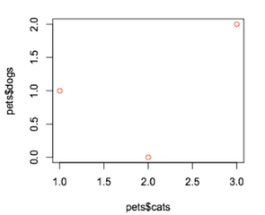
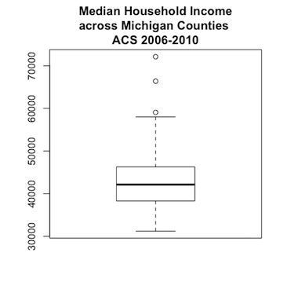
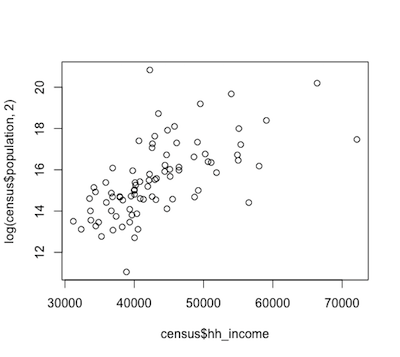

```{r global_options_&_setup, include=FALSE}
knitr::opts_chunk$set(eval=FALSE, tidy = TRUE, fig.align='center', out.width = '70%', out.height = '70%')
```

# Tutorial Introduction and Outline

This tutorial is the first of a two-part series providing basic instruction on how to (a) visualize data, and (b) use R for visualizations. 

Throughout the tutorial, the R code is preceded by this icon , indicating the content or example shown in the subsequent code. 

**Part 1** Includes:

1. **Installing R and Quick Tips**
      - Install R
      - Quick R Tips
2. **Uploading Data**
3. **Before Visualization: Understanding your Data**
      i. *Understanding Visualization Parameters*  
            - Dimensionality  
            - Defining Data Types  
            - Putting it Together  
      ii. *Organizing and Re-Structuring Data in R*  
            - Mapping to a Different Scale  
            - Selecting Subsets  
            - Scaling and Normalizing  
            - Aggregating  
4. **Visualizing 'Simple' Data (1-3 variables)**
      i. *Visualizing 1 Variable*  
            - Histograms  
            - Boxplots  
      ii. *Visualizing 2-3 Variables*  
            - Boxplot  
            - Scatterplot

*To see* **Part 2**, *visit: (Our apologies, this workshop is still under construction.)* 

# 1. Installing R and Quick Tips

## Install R
[R](https://www.r-project.org) is an open source language for graphics and statistical computing, and **must be downloaded** [here](https://cran.r-project.org/mirrors.html) **for this tutorial**. ([RStudio](https://www.rstudio.com/) is a helpful and commonly used graphical user interface for R, which can be downloaded [here](https://www.rstudio.com/products/rstudio/download3/) if desired.)

## Quick R Tips

To operate in R, you can run single commands or scripts (essentially text files with lists of commands), which are processed in the console. The useful shortcut for running a command line is pressing Ctrl + Enter on Windows, or Command + Enter on Mac. (Your cursor must be somewhere on the desired line for it run.)

Each command or function can have parameters defined by the user. A few quick tips:   

* Any text preceeded by a `#` is a comment to explain the code, and is not run by R.  

* Both `<-` or `=` are used to assign data to a variable (e.g. x) or data frame (essentially a collection of columns containing data). For example, running the following R code produces the answer seen in the second box:   

 *Assign values; Function example* 
```{r eval=TRUE, strip.white=FALSE}
x <- 2 #assigns the value '2' to the variable x
y = 3 #assigns the value '3' to the variable y
sumofxy <- sum(x,y) #uses the sum() function to add variables x and y, saving the results into variable sumofxy
sumofxy #displays value of sumofxy
```

* To find information about a function and its parameters in R, precede the function with `?` in the console to get help:  

 *HELP on a function* 
```{r tidy=FALSE}
?sum
```

* When you run into errors with R, your best resource is often the global community of R-users. Simply copy and paste your error or question into your search bar and browse forums where people have posed similar questions. ([Stack Overflow ](http://stackoverflow.com/questions/tagged/r) is a popular one.) 

* To begin getting a feel for R, run the following lines of helpful tricks one at a time in your R environment:  

 *Helpful tricks* 
```{r}
c(1,2,3) #concatenate a set of elements
1:20 #list numbers between two numbers
colors() #list all of R's colors
palette() #show the current order of colors

palette(rainbow(6)) #set colors
palette() #shows how current order of colors has been re-defined 

palette(c("green","brown","red")) #set user defined colors
palette() #shows how current order of colors has been re-defined 
```

One advantage of R being free and open source is a large base of users have created a wide diversity of 'plug-ins' available to users in the form of *packages*. Installing and opening a package allows you to use a whole new set of functions. For example, the following code installs and loads a package called `ggplot2`---a very helpful package for data visualization.  

 *Install & Load package* 
```{r}
install.packages("ggplot2")
library(ggplot2)
```


For further exploration of R, below are a few introductory resources: 

- [*Tutorials for Learning R*](https://www.r-bloggers.com/how-to-learn-r-2/) on r-bloggers.com
- [*Quick R*](http://www.statmethods.net/) by Robert I. Kabacoff, Ph.D.
- [*R for Data Science*](http://r4ds.had.co.nz/) by Garrett Grolemund and Hadly Wickham

# 2. Uploading data to R

To complete this tutorial, first **download and unzip the folder provided at the top of this tutorial**. Next, run the following line of code in the R console, which will prompt you to select the file labeled `data.csv` within your unzipped folder. 

 *Upload data* 
```{r}
census <- read.csv(file.choose()) #read in the csv file
```
You have now loaded the data into your R environment. As seen in the code above, when reading in your data file, you can assign the data to any name you want, but in this example we've used the name `census`, as this file contains census data downloaded from the [American Community Survey](https://www.census.gov/programs-surveys/acs/) for the state of Michigan from 2006-2010.

With your `census` data uploaded into the R environment, run the following lines of code to explore your dataset.

 *Explore data* 
```{r}
View(census) #view the data table in its entirety
names(census) #see all header (column) names
head(census) #see the headers plus the first six rows of data within each header
summary(census) #see some summary statistics of each column
fix(census) #open an excel-esque data editor (CAREFUL: there is no record of this change, nor does it change the data in the csv file)
```

To select a column of data, preface the name of the desired column with the name of its data set (in this case, `census`) and a `$`:

 *Select column of data* 
```{r}
census$rent
census$region
```


# 3. Before Visualization: Understanding your Data

Before visualizing data, it's important to:  

a. define your research question,  
b. understand the underlying data you're working with, and  
c. prepare the appropriate data as needed for visualization. 

(a.) The first step of defining your research question may seem trivial, but it guides many of your visualization decisions. Knowing your research question allows you to identify the variables relevant to your visualization or analysis, as well as how you think they'll relate to each other.

(b.) Once you've defined your research question, you can identify the number of variables you're interested in comparing---i.e. the **dimensionality** of your analysis---as well as the **type of data** contained in each variable of interest---e.g. is it continuous or discrete? 

(c.) Sometimes a final step is required, where the data needs to be organized or re-structured before the final step of visualization.

## 3.i. Understanding Visualization Parameters

### Dimensionality

**NOTE**: The graphs in this section are provided to visualize the dimensionality of the following data, but the code to produce such 2-dimensional scatterplots will be provided later in the tutorial, in section 4.ii.

The **dimensionality**, or number of variables you're interested in comparing, is one of the first parameters to determine the type(s) of visualizations available to you.  

To illustrate what different dimensions may look like, let's take data on your friends Jane, John, and Moe to document how many cats and dogs they own, and place that data into a `Pets` data frame in R.

Friend | cats | dogs| 
:------|:----:|:---:|  
Jane   |  2   |  0  |   
John   |  1   |  1  |    
Moe    |  3   |  2  |  

 *Create data and data frame* 
```{r eval=TRUE}
# enter each set of data in the same order
friends <- c("Jane", "John", "Moe")
cats <- c(2, 1, 3)
dogs <- c(0, 1, 2)

# create data frame
Pets <- data.frame(friends, cats, dogs, row.names=TRUE)
```

  
If our research question is "Is having a dog related to having a cat?" you are interested in the relationship between two variables: (1) having a dog, (2) having a cat. 

Since you're interested in two variables, this analysis is **2-dimensional**:  

  

If we find out your friends also have pet mice, we now want to know whether having any one of these three pets is related to having another pet. You'd now be interested in three variables (number of cats, dogs, mice), or a **3-dimensional** analysis:  

 *Add data to data frame* 
```{r eval=TRUE}
# enter data in the same order
Pets$mice <- c(1, 1, 4)
```

Friend | cats | dogs| mice|  
:------|:----:|:---:|:---:|  
Jane   |  2   |  0  |  1  |   
John   |  1   |  1  |  1  |    
Moe    |  3   |  2  |  4  |  

  

The dimensionality of an analysis is theoretically limitless, but becomes increasingly complicated (although sometimes more interesting) to visualize as more variables are included. How would you graph your friends' pet preferences once you added the fourth dimension of bird data?

Friend | cats | dogs| mice|birds|  
:------|:----:|:---:|:---:|:---:|  
Jane   |  2   |  0  |  1  |  1  |  
John   |  1   |  1  |  1  |  1  |    
Moe    |  3   |  2  |  4  |  5  | 


There are multiple ways to visualize this many dimensions, but a good place to start is often as multiple 2-dimensional plots; matching each variable to every other variable in a pair-wise fashion begins to reveal relationships in the dataset.


The following is a different visualization containing the same data, but answering a different research question, namely "How does pet ownership (of dogs, mice, cats, birds) differ between your friends?" 


Each visualization requires careful consideration of which relationships are important to show. The latter visualization is effective in showing how pets are distributed among your friends, but makes the relationship between owning one type of pet and owning another type of pet less clear than the former visualization. Again, the preferred or more appropriate visualization depends on your research question.


### Defining Data Types

Knowing **what kind of data** you're visualizing is also important, because it determines a great deal of your visualization (and statistical) possiblities. Each one of your variables should be classified as one of the following:

|DATA TYPE   |Definition                  | Example                       |
|:-----------|:-----------------------------:|:-----------------------------:|
|**Continuous** |can take on any value within a smooth interval|A dog's weight (could be measured to any fraction of a pound)|
|**Discrete  (ordered)**|can take on finite or countable values that have an order in relation to each other| Number of dogs your friends own (they can't own half a dog) |
|**Discrete  (unordered)**|can take on finite or countable values that have no order associated with them; can think of as bins, no in-between values and no inherent order to the types of bins| The names of your friends' dogs. |
*Definitions taken from* A Primer of Ecological Statistics 2^nd^ Ed. *by Nicholas J. Gotelli and Aaron M. Ellison*

To quickly test the concepts introduced above (dimensionality and data type), use the data collected on your friends' pets' to:    

**a.** define the main variables used in the last visualization created above  
**b.** categorize the type of data each variable contains  

*(View answers at the end of the following section.)*

### Putting it together...

Once you know the **dimensionality** and **type of data** needed for your research question, you're ready to decide what you'd like to visualize and how you'd like to do it.

For example, if you had 2-dimensional data (2 variables) where both variables were continous, you could produce a scatterplot. Or, if you had 3-dimensional data (3 variables) where all 3 variables were continuous, you could product a bubble chart.

See below for an illustation of a scatterplot or bubble plot, and notice the numerous visualization possibilites depending on dimensionality and type of data:


*Answers to quick test in previous section*:  
**a.** *possible answer: variable 1 - friends, variable 2 - type of pet, variable 3 - number of pets.*  
**b.** *variable 1 - discrete (unordered), variable 2 - discrete (unordered) , variable 3 - discrete (ordered)*

## 3.ii. Organizing and Re-Structuring Data in R

Oftentimes the data you receive is not formatted for visualization, or needs to be transformed. In such cases, R has a variety of function that can help.

### Mapping to a Different Scale

Returning to the `census` data set uploaded in Step 2., let's say we're interested in visualizing the rent data on a scale of 1-10. If our rent data is not already on this scale, we can easily map it to this scale in R.

To check the current scale of the rent data, run the following code to find the current maximum and minimum, or simply range of the data.

 *Find Maximum, Minimum, Range* 
```{r}
max(census$rent) #find maximum value of rent
min(census$rent) #find minimum value of rent
range(census$rent) #find range of rent
```

Before looking at the answer below, try using the following formula in R to map the rent variable in `census` to be between 1-10:

 *Formula to re-scale variable* 
```{r}
#(new_max - new_min) * ([value] - lowest_value) / (highest_value - lowest_value) + new_min
```

*Answer*:
```{r}
(10-1) * ( (census$rent - min(census$rent)) / (max(census$rent) - min(census$rent)) ) + 1
```

The following code now adds our re-scaled rent data as a new column labeled 'rent_10' to our `census` data set:

 *Create and Add new variable* 
```{r}
#it is easy to add a new column:
#census$newcol <- [formula]

census$rent_10 <- (10-1) * ( (census$rent - min(census$rent)) / (max(census$rent) - min(census$rent)) ) + 1

```

### Selecting Subsets

Another very useful data re-structuring technique involves extracting a subset of existing data. Try the following to subset the `census` data into 3 different unique data sets, each containing information about one 'region':

 *Subset data* 
```{r}

upper <- census[census$region=="upper",] #note the comma after the conditional!
View(upper) #compare how newly created "upper" differs from "census" data

central <- census[census$region=="central",] #without the comma it defaults to the second part
View(central)

lower <- census[census$region=="south",]
View(lower)
```

In R, census[1:5] returns the first 5 columns, as does census[,1:5], but census[1:5,] gives the first five rows.

### Scaling and Normalizing

R provides a variety of ways to transform data. Below are a few examples:

 *Transform and Add data*
```{r}
census$population_transf <- (census$population)^5 #Raises population to the power of 5
census$population_transf <- exp(census$population) #Raises the constant e to the power of population

census$population_transf <- cos(census$population) #Calculates the cosine of population
census$population_transf <- abs(census$population) #Finds the absolute value of population

census$population_transf <- (census$population)*10 #Multiplies population by 10
```

One of the most common types of transformations are logarithmic transformations. In R, the default setting computes the natural log (where the base is the constant e), but the base can be set if the user explicitly states it.

 *Log transformations*
```{r}
log(census$population) #Computes log base e of population
log(census$population, 2) #Computes log base 2 of population
log(census$population, 10) #Computes log base 10 of population
```

If you'd like to normalize one variable by using another, you can use simple operations. Try the following:

 *Create new variable from old variables*
```{r}
#create a variable of populations density by dividing population size by area
census$pop_density <- census$population/census$area

#log transform your new variable
log(census$pop_density)

```


### Aggregating

To aggregate data in R, one option is to use simple functions such as sum, mean/median, or variance/standard deviation functions.

 *Descriptive statistics*
```{r}
sum(census$population) # Computes sum of population
mean(census$population) # Computes mean of population
var(census$population) # Computes variance of population
sd(census$population) # Computes standard deviaation of population

#you can often nest functions within each other
median(log(census$population)) #Computes median of log of population
```

R also has an explicit function, aptly called `aggregate`, for aggregating data in complex ways, but it requires more advanced R knowledge that is outside the scope of this tutorial. (Remember, however, that to learn more about a function and how to use it, run `?[name of function]` in your R console, in this case `?aggregate`.) 

In any case, using Pivot tables in Microsoft Excel is also an excellent way to aggregate data. (If you haven't tried it, we highly recommend you do!)

# 4. Visualizing 'Simple' Data (1-3 variables)

Before starting to visualize our `census` data, a quick recap of the questions you should have answered before visualizing:  

* Have you defined your **research question**? 
    + *(so that you know your variables of interest)*  
* Do you know the **dimensionality** and **type(s) of data** in your data set?  
    + *(so that you're aware of the types of visualization available to you)*  
* Have you **organized your data** as needed? 
    + *(so that your data is ready to be used)*  
   
If so, you're ready to visualize away! 

## 4.i. Visualizing 1 Variable

Oftentimes it's useful to visualize a singular variable to understand the size and shape of its distribution, and to observe any outliers.

Histograms and boxplots are common ways to visualize singular **continuous** variables, both of which are easily done in R. 

### Histograms

Histogram plots are produced with the **hist()** function in R, and can be made more readable by adding additional parameters within the function. Run the lines below to see the differences.  
 *Histograms*
```{r}
hist(census$unemploy) # default graph, without labels
hist(census$unemploy,xlab="Unemployment",main="Histogram of Unemployment by County \nin Michigan") # inserting better x-axis label (xlab parameter) and title (main parameter)
```


An additional useful parameter is *breaks*, which allow users to increase or decrease the bin-size of the histogram. Notice how the choice of breaks alters the visualization:

 *Histogram breaks*
```{r}
hist(census$unemploy,xlab="Unemployment",main="Histogram of Unemployment by County; 6 breaks", breaks=6) 
hist(census$unemploy,xlab="Unemployment",main="Histogram of Unemployment by County; 20 breaks", breaks=20) 
```


### Boxplots

Boxplots are another useful way to show measures of distribution and can be called with the **boxplot()** function in R.  
Boxplots show the median (horizontal line in bold), the interquartile range (top and bottom edges of the rectangle), the lowest and highest values within 1.5 X the interquartile range (lower and upper whiskers extending from rectangle), and any outliers (shown as dots) in the data. Note that a variable must be continuous to view its distribution with a boxplot.

 *Boxplots*
```{r}
boxplot(census$hh_income, main="Median Household Income\nacross Michigan Counties \nACS 2006-2010") #'\n' signals a break into a new line
```


Try picking another variable in the `census` data and comparing its histogram and boxplot.

## 4.ii. Visualizing 2-3 Variables

Once you start including two variables in a visualization, you can finally start to chart relationships between variables. 

### Boxplots

While we've introduced boxplots of one variable in the previous section, boxplots can also be used to show more than one variable. As mentioned previously, to use boxplots the response variable needs to be **continuous**; but now, when considering two variables, the predictor variable can be **discrete**. 

Note the differences in syntax of your input variables in the following two examples:    

Example 1 Syntax: (*continuous* variable 1 ~ *discrete* variable 2)  

 *Boxplots*
```{r}
boxplot(hh_income ~ region,data=census, col=palette(rainbow(3)), main="Median Income by Region\nby County ACS 2006-2010") #this will give us household income by region
```


Example 2 Syntax: (*continuous* variable 1, *continuous* variable 2)

 *Boxplots*
```{r}
boxplot(census[,12],census[,13],col="lightblue",names=c("men","women"),main="Median Income by Sex For Population\nThat Worked Full-time Last 12 Months\nby County ACS 2006-2010") #selecting column 12 and 13 of the data frame 'census'
```


### Scatterplots

Scatterplots are extremely common for plotting 2 **continuous** variables and can be called by using the **plot()** function. In R, enter the variable intended for the x-axis first, followed by the variable 
intended for the y-axis.

 *Scatterplots*
```{r}
plot(census$unemploy,census$hh_income, cex=1.5)
#cex controls the size of the points (1 is default)
```


You can transform or even calculate a new variable within the plot function itself:

 *Scatterplot and Log Transformation*
```{r}
#we can plot the log of a variable by simply adding it to the plot command
plot(census$hh_income, log(census$population,2))
```


 *Scatterplot and Transformation*
```{r}
#for the y axis this is the population normalized by area (population density)
plot(census$hh_income, census$population/census$area)
```


We can also build up a plot by using the points function. In the example below, we're using the upper, central and lower subsets of data you created in section 3.ii.:

 *Scatterplot - building by layers*
```{r}

plot(c(0,max(census$rent)),c(0,max(census$hh_income)),
     type="n", xlab="Rent", ylab="Median Household Income") #create a blank canvas ('type' parameter) and add axis labels ('xlab' and 'ylab' parameters)
points(upper$rent,upper$hh_income,pch=20,col="blue")
points(central$rent,central$hh_income,pch=20,col="red")
points(lower$rent,lower$hh_income,pch=20,col="green")
legend("topleft", c("upper","central","lower"), pch=20, col=c("blue","red","green"), title ="Region", bty="n") # run '?legend' to figure out what these commands mean
```

  

See how many variables we included there? (3!)
